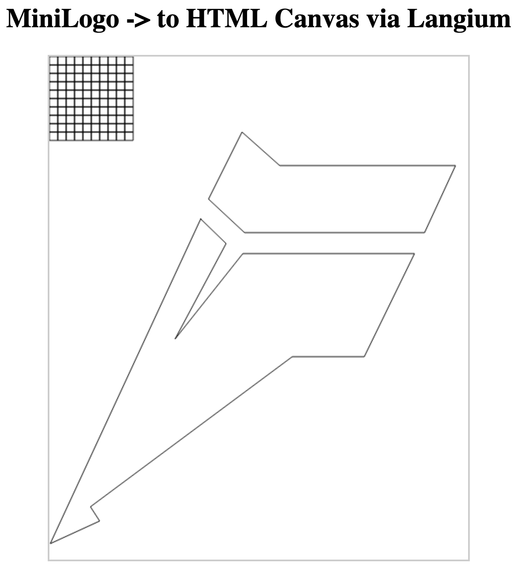

# MiniLogo in Langium

An example of implementing a simple DSL, MiniLogo, in Langium.

MiniLogo is a example language for operating a 'pen' to draw on a surface. If you're familiar with python's [Turtle graphics](https://docs.python.org/3/library/turtle.html), it's similar to that.

This implementation is based on [Eric Walkingshaw's grammar and semantics at OSU](https://web.engr.oregonstate.edu/~walkiner/teaching/cs381-wi21/minilogo.html).

Which in turn, is based on the [Logo language](https://el.media.mit.edu/logo-foundation/what_is_logo/logo_programming.html) itself.

There is, at this time, a single example in **examples/test.logo**. Which demonstrates the aspects of MiniLogo:
- **Move** commands to change position of the pen
- **Pen up/down** commands to change the drawing state
- Basic arithmetic expressions of **literal ints**, **references**, and **binary expressions**. Parenthesized and negated expressions are allowed as well
- Common arithmetic binary functions are in prefix notation: **add**, **sub**, **mul** and **div**
- **For** loops allow a means to bind a single variable to an expr, with a second expression as an excluded upper bound, and a body of statements that are executed on each loop
- **Macros** are definable, taking arguments upon calling that are bound to parameters which can be referenced in a macro's body

Notably, there is *no branching* instruction present, as there are *no booleans* present in this language.

## Running in the Web

...coming soon...

## Running Locally

To run this simple language, you can first build up the grammar

To run the language you can first generate from the langium grammar, and build the project:
```bash
$ npm run langium:generate
$ npm run build
```

After this you can generate the resulting code from the given MiniLogo test program (or another if you wish). This implementation using Langium genererates 2 files:
- **test.html**, a simple HTML page with a canvas where the results are shown
- **test.js**, a simple JS file where MiniLogo instructions are compiled into equivalent drawing commands for the canvas

```bash
$ npm run generate:test
```

The result is present in `examples/generated/test.html`, which you can open in your browser, and view the following.



For a more advanced example, you can generate a program that will draw an approximation of the langium logo.

```bash
$ npm run generate:logo
```

For convenience, the pre-generated examples are included in this repo already under [/examples/generated/](https://github.com/montymxb/minilogo-langium-example/tree/main/examples/generated).

